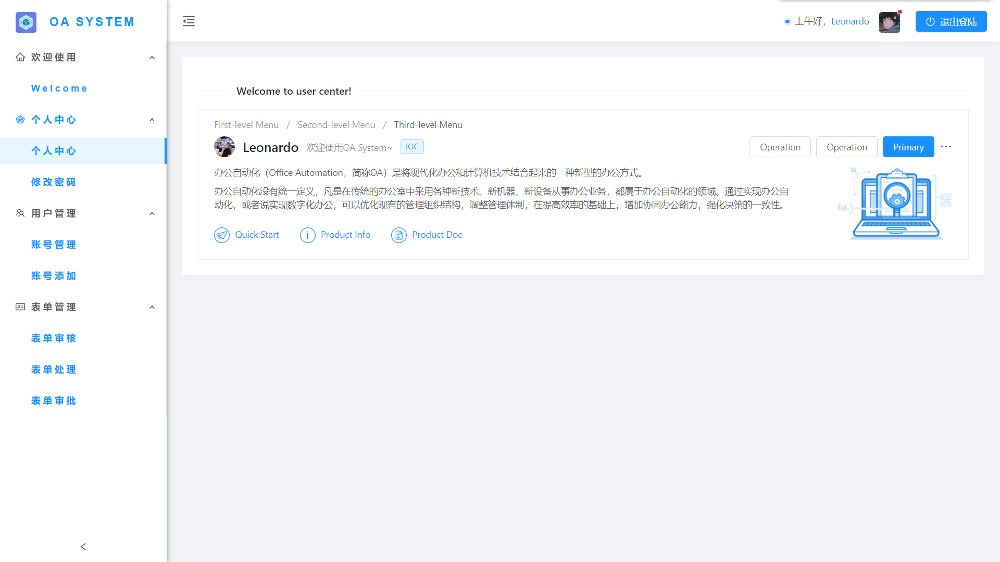
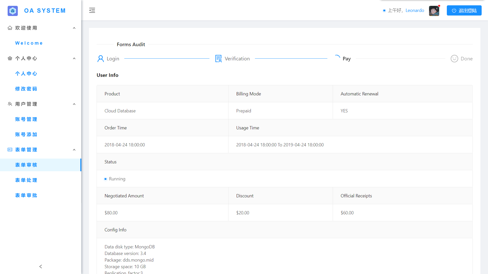

# OASystem

This project was generated with [Angular CLI](https://github.com/angular/angular-cli) version 9.0.7.

# 一、简介

## 1、项目介绍

- 基于 AngularV8，Ng-Zorro 开发的后台管理系统
- 【源码地址】[https://github.com/LeonardoRain/OA-System](https://github.com/LeonardoRain/OA-System)

> 预览效果图 - 登录页


> 预览效果图 - 个人中心



> 预览效果图 - 修改密码


> 预览效果图 - 账号管理


> 预览效果图 - 账号添加


> 预览效果图 - 表单审核



> 预览效果图 - 表单处理


> 预览效果图 - 表单审批


## 2、 平台功能开发进度

- [x] 登录(用户名、密码)
- [x] 首页
- [x] layout
- [x] 多 tab 页路由复用策略
- [x] 退出登录
- [x] 修改密码
- [x] 系统消息(侧边栏消息)
- [x] UI 控件（Ant Design）
- [x] 引入阿里图标库
- [x] 清除本地缓存
- [x] 模版页面（列表、表单、详情、树列表）

# 二、安装项目

- 在 `git` 、`node`、`npm`、`vscode`  配置好多前提下，克隆代码，命令如下：

```bash
克隆代码: git clone https://github.com/LeonardoRain/OA-System.git
安装依赖: npm install
启动项目: ng serve
启动Json Server: npm run start:devserver
```

- 在浏览器中输入 `http://localhost:4200` ,项目启动成功, 在`package.json` 中可修改端口号
- 查看 JsonServer 服务器登陆数据可访问 `http://localhost:3200/users`
  样例登录信息：

  ### 1 （管理员账户）

  用户名: Leonardo_Admin
  密码: 3.1415926

  ### 2 （普通员工账户）

  用户名: Leo_Test
  密码: 12345678

# 三、开发代码

<a name="98245d55"></a>

## 1、 代码规范

- 按照 angular 官网提出的 `风格指南`  开发代码

【风格指南】[https://angular.cn/guide/styleguide#prevent-re-import-of-the-core-module](https://angular.cn/guide/styleguide#prevent-re-import-of-the-core-module)

## 2、 前后端通信

【使用 httpClient 以及 JsonServer】[https://angular.cn/guide/http](https://angular.cn/guide/http)

# 四、学习帮助

- [【angular 官网】](https://angular.cn/docs)
- [【typescript 官网】](http://www.typescriptlang.org/index.html)<br/>
- [【ng.ant.design 官网】](https://ng.ant.design/docs/introduce/zh)
- [【if 我是前端团队 Leader，怎么制定前端协作规范?】](https://juejin.im/post/5d3a7134f265da1b5d57f1ed#heading-18)
- [【优雅的提交你的 Git Commit Message】](https://zhuanlan.zhihu.com/p/34223150)

# 五、常见问题

1、 如何修改组件内部样式？

> 注意 由于 Angular 的样式隔离，修改 ant.design 组件内的样式 需要用::ng-deep 来覆盖 NgZorro 的样式

2. 打包如何优化？
   开启 `aot` 打包，输入以下命令

```bash
npm run aot
```

`aot` 打包时，优化编译时对 ts 语法检查非常严谨，如果有错误就一个一个的去改，直到错误修改完成，`aot`打包才能通过

`.prettierrc`、`.editorconfig` 文件配置参考自 [Ng-Zorro 官方源码](https://github.com/NG-ZORRO/ng-zorro-antd/blob/master/.editorconfig)
